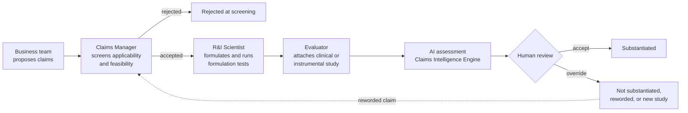

# 1. Business process understanding

## 1.1 The claim lifecycle

A claim moves through four roles, each with one decision. The engine sits between the evaluator's evidence and the final decision, and adds an explicit human review step.

The claim's `status` field in the database mirrors this flow:

| Status | Meaning | Set by |
|---|---|---|
| `PROPOSED` | Business has suggested the claim | Business |
| `SCREENING` | Claims Manager is checking it | Claims Manager |
| `REJECTED_AT_SCREENING` | Not applicable or not feasible | Claims Manager |
| `IN_FORMULATION` | Scientist is formulating and testing | Scientist |
| `AWAITING_EVIDENCE` | Ready for a study to be attached | Scientist / system |
| `UNDER_ASSESSMENT` | At least one AI assessment exists, awaiting review | System |
| `SUBSTANTIATED` | A reviewer confirmed the study proves the claim | Reviewer |
| `NOT_SUBSTANTIATED` | A reviewer confirmed the study does not support it | Reviewer |
| `WITHDRAWN` | Dropped by the business | Business |

When a reviewer decides the evidence is *insufficient*, the claim returns to `AWAITING_EVIDENCE`, because the right next step is another study, not rejection.

## 1.2 What each role needs

| Role | Decision | What the system gives them |
|---|---|---|
| Business team | Which claims drive consumer appeal | Propose claim variants per product, track status |
| Claims Manager | Is the claim legally applicable in the target markets, and realistically provable? | Claim type, markets, and a structured breakdown (metric, target, timeframe) |
| R&I Scientist | Formula and test design | The exact claim wording the formula must support |
| Evaluator | Does this study prove this claim? | Evidence entry, AI first pass, side-by-side comparison, accept or override |

## 1.3 Claim types need different proof

| Claim type | Example | Typical evidence |
|---|---|---|
| Quantified efficacy | "Reduces wrinkles by 20% in 4 weeks" | Instrumental clinical study, baseline vs endpoint, statistics |
| Qualitative efficacy | "Hydrates for 24 hours" | Instrumental measurement over the full duration |
| Consumer perception | "9 out of 10 women say skin feels smoother" | Self-assessment questionnaire, panel size, agreement rate |
| Sensory | "Non-greasy texture" | Trained sensory panel |
| Comparative | "Twice the hydration of our previous formula" | Head-to-head study against the named comparator |
| Free from | "Fragrance-free" | Formula composition plus the specific regulatory criteria |
| Safety and tolerance | "Dermatologically tested" | Tolerance study under dermatological supervision |

## 1.4 Why the example claim is harder than it looks

*"Reduces wrinkles by 20% in 4 weeks"* is really four separate promises, each of which a study can fail on its own:

- **What is measured.** "Wrinkles" could mean depth, volume, count or visual grading. A hydration study does not support it.
- **How much.** At least 20%. Mean or median? Versus baseline or versus a placebo? On how many people?
- **When.** By week 4. A result measured only at week 8 does not prove a 4-week claim, even if it is larger.
- **On whom.** Was the panel representative of the people the product is sold to?

Timeframes also come in two kinds that need opposite checks. "In 4 weeks" means the effect must appear **by** day 28. "Hydrates for 24 hours" means the effect must **still be present at** hour 24. A study that measured hydration up to 8 hours proves the first kind of claim quickly, but not the second. The data model records which kind each claim is.

So the engine first breaks the claim down, then extracts the matching facts from the study, then compares them one by one. The side-by-side table in the UI shows exactly this comparison.

## 1.5 Pain points addressed

| Today | With the engine |
|---|---|
| Evaluators read long reports manually | A structured first pass in seconds to a minute |
| Different evaluators judge similar evidence differently | The same six criteria applied every time |
| The reasoning behind an approval is often lost | Reasoning, extracted facts, model and prompt version stored with each decision |
| Failed claims are just rejected | A suggested wording that the existing study does support |
| Hard to know which studies back which claims | Every claim links to its evidence and assessments |

## 1.6 Assumptions and open questions

Assumed for this version: the claim already exists when evidence arrives; evidence is text; the final decision is always made by a person.

Questions for the business: who has final sign-off (evaluator, regulatory, or both)? What internal study standards exist today (minimum panel size, accepted instruments)? Which markets come first? Can historical claim decisions be used to build an evaluation set?
