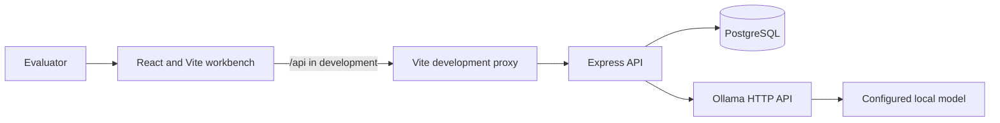
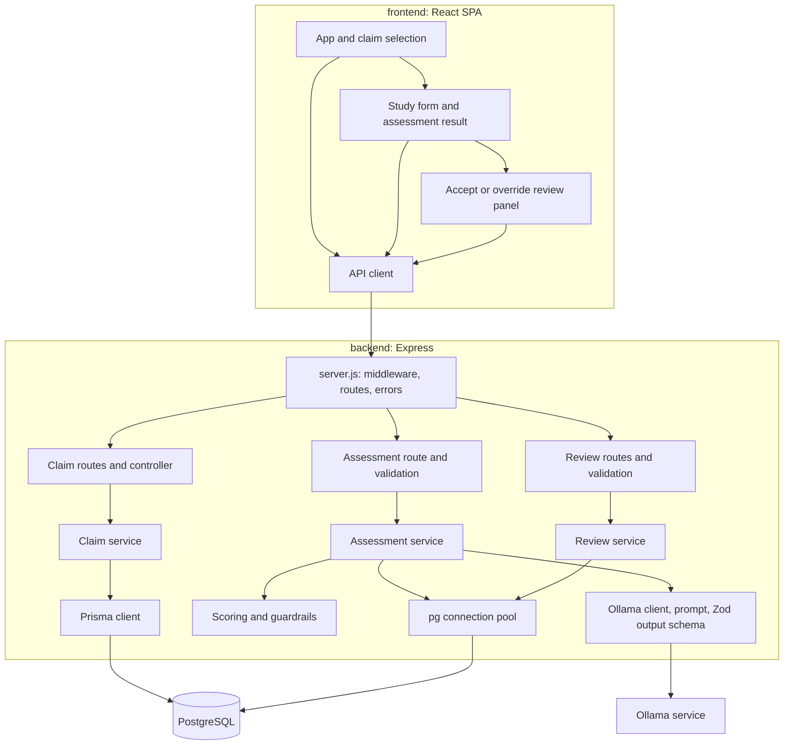
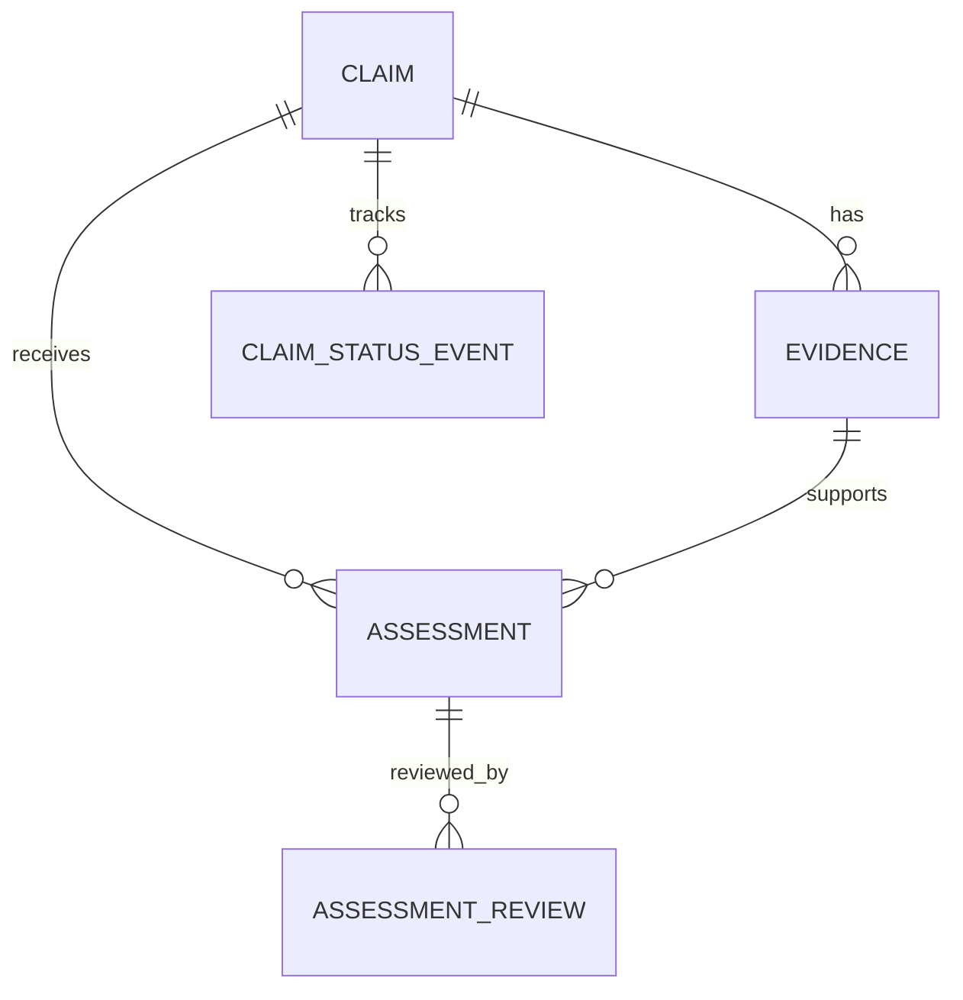

# Technical Architecture

This document describes the implementation currently in this repository, not a target production design.

## System Context

The evaluator workbench is a React single-page app. It sends JSON requests to the Express API; the API reads and writes PostgreSQL and calls the local Ollama service for evidence assessment.



In development, Vite proxies `/api` to `http://localhost:3001`; the backend defaults to port `3000` unless `PORT` is set. Set `PORT=3001` or update the Vite proxy so the two defaults agree. The API also enables permissive CORS for the demo.

## Runtime Components



Claim create/list use Prisma (`services/claim.service.js`). Evidence, assessment, and review persistence use parameterized SQL through `pg` (`repositories/*`). Both clients connect to the same `DATABASE_URL`. The Prisma schema is the declared relational model, but it does not mean all runtime persistence goes through Prisma.

## Request Flows

### Assess evidence

```mermaid
sequenceDiagram
    actor Evaluator
    participant UI as React workbench
    participant API as Express API
    participant Service as assess.service
    participant DB as PostgreSQL
    participant Model as Ollama

    Evaluator->>UI: Enter study, select market, assess
    UI->>API: POST /api/assess
    API->>API: Validate request with Zod
    API->>Service: assess(claimId, market, evidence)
    Service->>DB: Load claim and validate market
    Service->>DB: Find or insert evidence by content hash
    Service->>Model: Send prompt and JSON schema
    Model-->>Service: Structured findings, criteria, reasoning
    Service->>Service: Validate output; retry once on schema failure
    Service->>Service: Derive verdict, confidence, and guardrail flags
    Service->>DB: Insert assessment
    Service-->>API: Assessment result
    API-->>UI: JSON assessment
```

The assessment is synchronous, so the browser waits for the model call. Evidence is written before inference; if inference fails, that evidence row remains. Assessment creation is not wrapped with evidence creation in a single transaction, and repeated assessment requests are not idempotently returned from a stored input hash.

The model output is validated against `LlmOutputSchema`. `deriveVerdict` determines the verdict from criterion statuses (`NOT_MET` yields `NOT_JUSTIFIED`, otherwise `UNCLEAR` yields `INSUFFICIENT_EVIDENCE`, otherwise `JUSTIFIED`). `computeGuardrails` adds flags for a timepoint beyond study duration, sample size below policy, baseline-only comparator, missing statistical significance, or an out-of-range effect percentage. These flags reduce confidence; they do not currently change the verdict.

### Human review

`POST /api/assessments/:assessmentId/reviews` validates and appends an `ACCEPTED` or `OVERRIDDEN` review row. An override includes a human verdict and note. The GET route returns review history, but the current frontend only submits the decision and keeps the returned row in local UI state. Review does not currently roll up or update the claim status.

## Data Model and Persistence

The declared schema is in [`backend/prisma/schema.prisma`](../backend/prisma/schema.prisma).



- `Claim` stores product, claim text, markets, structured claim fields, and status.
- `Evidence` belongs to a claim and has a normalized-content SHA-256 hash; the schema makes `(claimId, contentHash)` unique.
- `Assessment` stores verdict, confidence, reasoning, criteria, extracted findings, guardrail flags, and model/prompt traceability.
- `AssessmentReview` is a separate decision record. The service inserts reviews rather than updating assessment output.
- `ClaimStatusEvent` is declared in the schema, but the current review flow does not write status events.

## Deployment and Configuration

`docker-compose.yml` runs PostgreSQL 16 and Ollama, plus a one-shot Ollama model pull. It does not build or run the frontend or backend. Those are started separately with the npm scripts in their respective directories. PostgreSQL is published on `127.0.0.1:5433`; Ollama is published on `127.0.0.1:11434`.

The backend reads `DATABASE_URL`, `PORT`, `OLLAMA_HOST`, `OLLAMA_MODEL`, `OLLAMA_NUM_CTX`, `OLLAMA_TIMEOUT_MS`, and `POLICY_MIN_SAMPLE_SIZE` from its environment. Its configured Ollama default is `llama3.1:8b`; the Compose pull default is `llama3.2:3b`, so set `OLLAMA_MODEL` consistently to avoid requesting a model that was not pulled.

## Current Boundaries and Production Gaps

| Concern | Current implementation | Production consideration |
|---|---|---|
| Identity | Static `demo-evaluator` actor; no authentication middleware | Add SSO and derive actor IDs from verified identity |
| Authorization | No role checks | Authorize claim, market, assessment, and review operations |
| API exposure | Open CORS in the backend; no reverse proxy in Compose | Restrict origins and use a production ingress/TLS boundary |
| Persistence access | Prisma for claim CRUD; raw `pg` queries for assessment/evidence/review | Standardize on one access layer or clearly own both migration and query contracts |
| Assessment lifecycle | Synchronous model call; evidence can persist if assessment fails | Add job processing and explicit assessment states for long-running inference |
| Audit and status | Review rows are inserted, but claim status is not rolled up by review | Define and implement status transition and audit-event rules |
| Port configuration | Vite proxy points to 3001; API default is 3000 | Align defaults and document environment setup |

## Main Source Locations

- API setup and route mounting: [`backend/src/server.js`](../backend/src/server.js)
- Assessment orchestration: [`backend/src/services/assess.service.js`](../backend/src/services/assess.service.js)
- Model prompt and Ollama call: [`backend/src/llm/ollama.client.js`](../backend/src/llm/ollama.client.js)
- Guardrails and verdict scoring: [`backend/src/services/guardrails.js`](../backend/src/services/guardrails.js), [`backend/src/services/scoring.js`](../backend/src/services/scoring.js)
- Claim persistence: [`backend/src/services/claim.service.js`](../backend/src/services/claim.service.js)
- Assessment and review SQL: [`backend/src/repositories/`](../backend/src/repositories/)
- Frontend entry flow: [`frontend/src/App.jsx`](../frontend/src/App.jsx)
- Local infrastructure: [`docker-compose.yml`](../docker-compose.yml)
